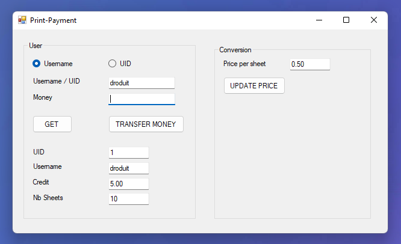

<h1 align="center">
   Print-Payment
</h1>

    <strong>A SOAP Webservice and a Windows desktop application to handle student printing credit 🖨💰</strong>

    

 

## Table of Contents

1. [Getting Started](#getting-started)
2. [Technologies](#technologies)
3. [Guides and resources](#guides-and-resources)
4. [Authors](#authors)
5. [License](#license)

## Getting Started

### Running the Webservice and the desktop application

You will need to follow the steps below in order to run the projects :

1. Download the project files to your computer and open the solution in Visual Studio.
2. Create the database, the tables and insert data. You can find the required tables and test data in the `Create_tables_and_insert_data.sql` script file.
3. Change the connectionString in the `Web.config` file of the `PrintPayment_Webservice` project according to your database.

    _By default, the `providerName` attribute of the connectionString is set to "System.Data.SqlClient". Therefore, the project expects to interact with a SQLServer database. If you use another DBMS, change the attribute value as well._
    
4. Configure the solution to automatically run both projects (Webservice and WinForm) when you run the solution. Do that by going in the solution's properties, then select `Common Properties > Startup Project` and choose the "Multiple startup projects" option. Select "Start" as action for both projects `PrintPayment_Webservice` and `PrintPayment_WinForm`. If you choose not to do that and run manually each project, ensure to run the Webservice first before the WinForm.
5. Run the solution with the green "play" button.

    N. B. 2 : By default, the Webservice is reachable at `http://localhost:54333/PrintPayment.svc`. If port `54333` is already used by another process, change the project's URL used in the properties of the `PrintPayment_Webservice` project, in the `Web` section, then change the URL in the `App.config` file of the `PrintPayment_WinForm` project as well.

Once these 4 steps have been done, **you are ready to feel again the broke student in you and take revenge on life by giving yourself lots of printing credit !**

## Technologies

Both the Webservice and the WinForm are entirely written in C# and use .NET Framework 4.8.

The code has been designed following the Three-Tier Architecture.

## Guides and resources

* [.NET](https://dotnet.microsoft.com/) - A developer platform for building all your apps
* [Visual Studio](https://visualstudio.microsoft.com/) - The Visual Studio code editor

## Authors

<table>
   <tbody>
      <tr>
         <td align="center">
            <a href="https://github.com/d-roduit">
             
            Daniel Roduit
            </a>
         </td>
         <td align="center">
            <a href="https://gitlab.com/g.cathy">
             
            Cathy Gay
            </a>
         </td>
      </tr>
   </tbody>
</table>

## License

This project is licensed under the MIT License
